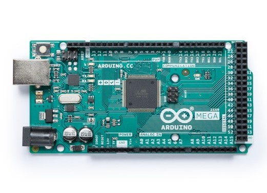
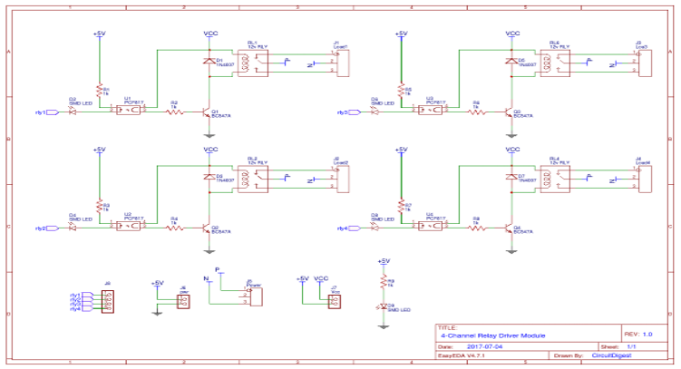
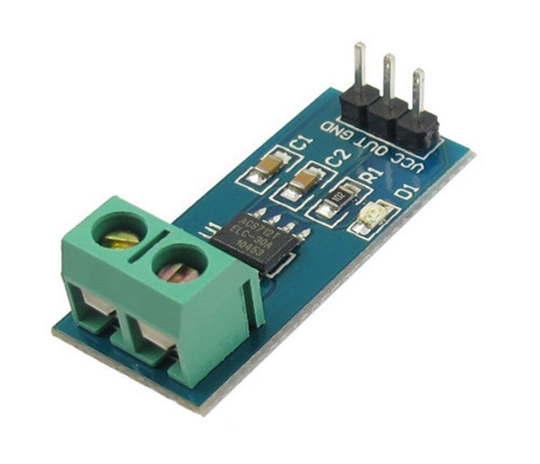
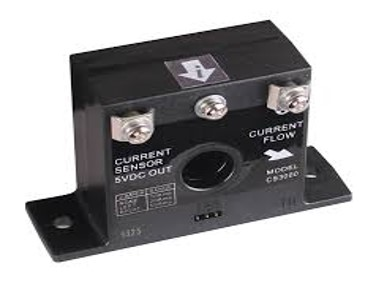

# Arduino-Mega-2560-

	The MEGA 2560 is designed for more complex projects. 
  With 54 digital I/O pins, 16 analog inputs and a larger space for your sketch it is the recommended board for 3D printers and robotics projects. 
  This gives 	our projects plenty of room and opportunities. The Arduino Mega 2560 is a microcontroller board based 	on the ATmega2560. 
  It has 54 digital input/output pins (of which 15 can be used as PWM outputs), 16 	analog inputs, 4 UARTs (hardware serial ports), 
  a 16 MHz crystal oscillator, a USB connection, a power jack, 	an ICSP header, and a reset button. 
  It contains everything needed to support the microcontroller; simply 	connect it to a computer with a USB cable or power it with an AC-to-DC adapter or battery to get started.
  The Mega 2560 board is compatible with most shields designed for the Uno and the former boards 	Duemilanove or Decimal. The Mega 2560 is an update to the Arduino Mega, 
  which it replaces.
  
  
  
  4 channel relay module:
  
	In this project, we will make a 4-Channel Relay Driver Module Circuit for relay-based applications. 
  In this 	circuit, we have designed an isolated PCB for 4 relays. By using this Relay Board, 
  we can operate 4 AC 	appliances at a time. We have put a three pin screw terminal blocks (NC, Neutral, NO) for connecting 	appliances. 
  Below are the circuit diagram and PCB layout designs of the relay 	driver.
  
  For more information, https://easyeda.com/circuitdigest/RelayBoard-d3f1fbcfc99540738b4f76aceef8882b
  
  

  A current sensor :
  
	As a device that detects electric current in a wire and generates a signal proportional to that current. 
  The generated 	signal could be analog voltage or current or even a digital output. 
  The generated signal can be then used to display 	the measured current in an ammeter or can be stored for further analysis in a data acquisition system or 
  can be used 	for the purpose of control.
  
  The sensed current and the output signal can be:
  
  Alternating current input, 
  Analog output, which duplicates the wave shape of the sensed current.
  Bipolar output, which duplicates the wave shape of the sensed current.
  Unipolar output, which is proportional to the average or RMS value of the sensed current.
  Direct current input, 
  Unipolar, with a unipolar output, which duplicates the wave shape of the sensed current.
  Digital output, which switches when the sensed current exceeds a certain threshold.
  
     
   
🚩 Connect with me on social
- LinkedIn: https://www.linkedin.com/in/ariful-islam-arif-2987b51a3/
- Twitter: https://twitter.com/arifulislam301
- Instagram: https://www.instagram.com/ariful_mr_islam/

🔔 Subscribe to my YouTube channel
https://www.youtube.com/channel/UCED68cm6nHaAlAk0h9I3yAQ
  
  
  
